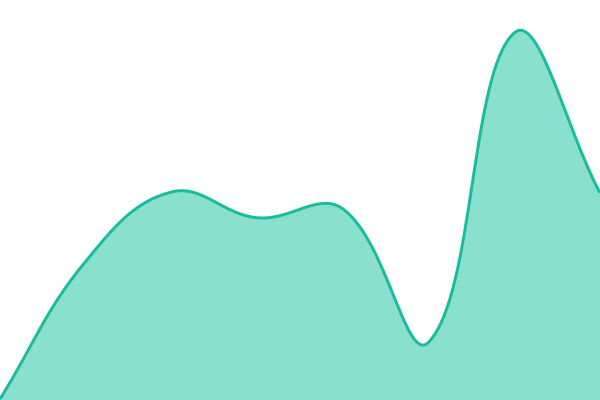

# [📈 Live Status](https://status.nexcloud.enterprises): <!--live status--> **🟩 All systems operational**

This repository contains the open-source uptime monitor and status page for [MrRamyg](https://discord.gg/baYRgfa8kv), powered by [Upptime](https://github.com/upptime/upptime).

With [Upptime](https://upptime.js.org), you can get your own unlimited and free uptime monitor and status page, powered entirely by a GitHub repository. We use [Issues](https://github.com/MrRamyg/NexCloudStatus/issues) as incident reports, [Actions](https://github.com/MrRamyg/NexCloudStatus/actions) as uptime monitors, and [Pages](https://status.nexcloud.enterprises) for the status page.

<!--start: status pages-->
<!-- This summary is generated by Upptime (https://github.com/upptime/upptime) -->
<!-- Do not edit this manually, your changes will be overwritten -->
<!-- prettier-ignore -->
| URL | Status | History | Response Time | Uptime |
| --- | ------ | ------- | ------------- | ------ |
|  [NexCloud Enterprises Website](https://nexcloud.enterprises) | 🟩 Up | [nex-cloud-enterprises-website.yml](https://github.com/MrRamyg/NexCloudStatus/commits/HEAD/history/nex-cloud-enterprises-website.yml) | 

 847ms
     
 | 

<a href="https://status.nexcloud.enterprises/history/nex-cloud-enterprises-website">100.00%</a>
    

|  [Nexfinity Hosting](https://nexfinityhosting.com) | 🟩 Up | [nexfinity-hosting.yml](https://github.com/MrRamyg/NexCloudStatus/commits/HEAD/history/nexfinity-hosting.yml) | 

 206ms
     
 | 

<a href="https://status.nexcloud.enterprises/history/nexfinity-hosting">100.00%</a>
    

|  [Community Forum](https://forum.nexcloud.enterprises) | 🟩 Up | [community-forum.yml](https://github.com/MrRamyg/NexCloudStatus/commits/HEAD/history/community-forum.yml) | 

 567ms
     
 | 

<a href="https://status.nexcloud.enterprises/history/community-forum">100.00%</a>
    

|  [js4u.site](https://js4u.site) | 🟩 Up | [js4u-site.yml](https://github.com/MrRamyg/NexCloudStatus/commits/HEAD/history/js4u-site.yml) | 

 618ms
     
 | 

<a href="https://status.nexcloud.enterprises/history/js4u-site">100.00%</a>
    

<!--end: status pages-->

[**Visit our status website →**](https://status.nexcloud.enterprises)

## 📄 License

- Powered by: [Upptime](https://github.com/upptime/upptime)
- Code: [MIT](./LICENSE) © [Anand Chowdhary](https://anandchowdhary.com)
- Data in the `./history` directory: [Open Database License](https://opendatacommons.org/licenses/odbl/1-0/)
